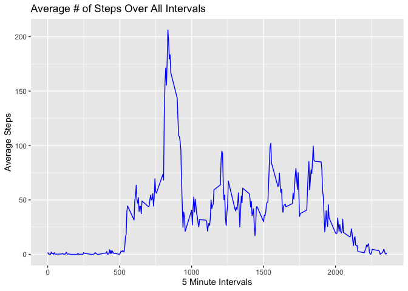

#Project 1 for Reproducible Research

###Loading R libraries

```r
library(dplyr)
library(ggplot2)
library(tidyr)
library(lubridate)
library(gridExtra)
```

##About the dataset: 
#Activity monitoring data. This data is from a personal activity monitoring device that collects the number of steps taken at 5 minute intervals throughout the day.There are two months of data from anonymous individuals from October to November, 2012.

##Variables included in data set: 
* steps: Number of steps taking in a 5-minute interval (missing values are coded as NAs)

* date: The date on which the measurement was taken in YYYY-MM-DD format

* interval: Identifier for the 5-minute interval in which measurement was taken

##Loading data set without NAs


```r
data_full <- read.csv("/Users/elaine/OneDrive - SAGE Publishing/Laptop/Courses/Data_Science_course_JohnsHopkins/Reproducible/ReprodResearchProj1/activity.csv", header=T)
data<- data_full[!is.na(data_full$steps),]
head(data)
```

```
##     steps       date interval
## 289     0 2012-10-02        0
## 290     0 2012-10-02        5
## 291     0 2012-10-02       10
## 292     0 2012-10-02       15
## 293     0 2012-10-02       20
## 294     0 2012-10-02       25
```

#*What is the mean total number of steps taken per day?*

##First create data with the total number of steps by date

```r
steps_per_day <- aggregate(steps ~ date, data, FUN=sum)
```

##Create histogram of total steps per interval


```r
library(ggplot2)
g <- ggplot(steps_per_day, aes(x=steps, fill="red" ))
g+ geom_histogram(binwidth=600, col="black") + labs(x="Totals of Steps per Day", 
                                       title="Histogram of Steps per Day") + 
                                        theme(legend.position = "none")
```

<!-- -->


```r
med <-median(steps_per_day$steps)
avg <-round(mean(steps_per_day$steps))
```
###**The median number of steps taken per day is 10765.**
###**The mean number of steps taken per day is 1.0766\times 10^{4}.**


#*What is the average daily activity pattern?*
##Create steps per interval.

```r
steps_per_interval <- aggregate(steps ~ interval, data, FUN=mean)
```
##Here is a time plot seriestime series of the 5-minute intervals and the average number of steps taken, averaged across all days.


```r
g1 <- ggplot(steps_per_interval, aes(interval, steps)) 

g1 + geom_line(col="blue") + labs(x="5 Minute Intervals", y="Average Steps", 
                        title="Average # of Steps Over All Intervals")       
```

<!-- -->

##Which 5-minute interval, on average across all the days in the dataset, contains the maximum number of steps?

```r
x <-steps_per_interval[which.max(steps_per_interval$steps), ]
```
###**Interval 835 has the maximum number with 206 steps.**


#*Imputing missing values*

```r
total_NA <- sum(is.na(data_full))
```
###**The total number of NAs is 2304.**


##Replacing NAs with zeros in origina data set

```r
data_full[is.na(data_full)] = 0
```
 
##Here is a histogram of the total number of steps taken each day with zeros in place of NAs

```r
data_full_steps<- aggregate(steps ~ date, data_full, FUN=sum)

g2 <- ggplot(data_full_steps, aes(x=steps))
g2 + geom_histogram(binwidth = 800, fill="blue") + labs(x="Totals of Steps per Day", 
                                          title="Histogram of Steps per Day with no NAs") + 
        theme(legend.position = "none")
```

<!-- -->
##Find average and median steps with no NAs

```r
med2 <- mean(data_full_steps$steps)
avg2 <- median(data_full_steps$steps)
```

###**The average amount of steps with zeros replacing NAs is 1.0395\times 10^{4} and the median is 9354.2295082.**

##What is the difference from original mean and median when replacing NAs with zeros?

###Changing the NAs to zeros decreased both the median and mean. The median is 10765 and average is 1.0766\times 10^{4}. With zeros replacing the NAs, the median goes down to 9354.2295082 and average to 1.0395\times 10^{4}.

#*Are there differences in activity patterns between weekdays and weekends?*

##First create a new factor variable in the dataset with two levels – “weekday” and “weekend” and add to data frame


```r
library(lubridate)
```

```
## 
## Attaching package: 'lubridate'
```

```
## The following object is masked from 'package:base':
## 
##     date
```

```r
library(gridExtra)
data_full$day<- wday(data_full$date, label=T)
data_full$day_type<- ifelse(data_full$day %in% c("Sat","Sun"), "weekend", "weekday") 
head(data_full)
```

```
##   steps       date interval day day_type
## 1     0 2012-10-01        0 Mon  weekday
## 2     0 2012-10-01        5 Mon  weekday
## 3     0 2012-10-01       10 Mon  weekday
## 4     0 2012-10-01       15 Mon  weekday
## 5     0 2012-10-01       20 Mon  weekday
## 6     0 2012-10-01       25 Mon  weekday
```

```r
data_week <- subset(data_full, data_full$day_type=="weekday")
data_weekend <- subset(data_full, data_full$day_type=="weekend")

steps_per_interval_week <- aggregate(steps ~ interval, data_week, FUN=mean)
steps_per_interval_weekend <- aggregate(steps ~ interval, data_weekend, FUN=mean)
```
##Here is a panel plot containing a time series plot of the 5-minute interval and the average number of steps taken, averaged across all weekday days or weekend days 

```r
g3 <- ggplot(steps_per_interval_week, aes(x=interval, y=steps))
g3 <-g3 + geom_line(col="blue") + labs(x="5 Minute Intervals", y="Average Steps", 
                                          title="Week Day Average # of Steps Over All Intervals")       
g4 <- ggplot(steps_per_interval_weekend, aes(x=interval, y=steps))
g4 <-g4 + geom_line(col="green") + labs(x="5 Minute Intervals", y="Average Steps", 
                                 title="Weekend Average # of Steps Over All Intervals")       

grid.arrange(g3, g4, nrow=2, ncol=1)
```

<!-- -->
